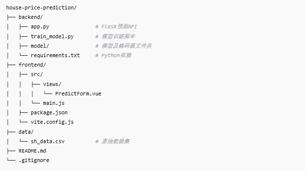

# 房价预测系统（House Price Prediction）

基于PyTorch深度学习框架，结合多维连续数值特征与类别特征Embedding技术，构建的精准房价预测模型。项目包含从数据清洗、特征工程、模型训练、模型保存，到基于Flask的REST API预测服务及Vue3前端交互界面。

---

## 项目背景

随着城市房地产市场的复杂化，传统的简单线性模型难以准确捕捉多维度房屋特征对价格的影响。本项目利用深度学习技术，针对上海二手房数据，通过合理的特征处理和神经网络设计，实现更准确的房价预测，帮助用户科学决策。

---

## 主要功能

- **数据预处理**：解析楼层信息、户型、朝向等多样化字段，自动提取结构化特征  
- **类别特征编码**：采用`LabelEncoder`和Embedding处理类别变量，提升模型表达能力  
- **连续特征标准化**：保证特征数值稳定，便于神经网络训练  
- **模型训练**：结合连续特征与Embedding特征，训练多层神经网络进行回归预测  
- **预测服务**：基于Flask搭建API，支持前端调用，实现实时在线预测  
- **前端交互**：基于Vue3和Axios，提供用户友好的预测输入表单和结果展示  

---

## 数据说明

- 数据集：上海二手房公开数据（`data/sh_data.csv`）  
- 主要特征包括：面积（square）、楼层信息（floor_level、total_floor）、户型（room、hall、kitchen、bath）、朝向（direction_simple）、装修（decoration）、电梯情况（elevator）、产权（ownership）、总价（total_price）  
- 对部分非结构化字段如`floor`和`size`进行正则解析，提取结构化特征  

---

## 技术栈

| 组件         | 技术/库              | 说明                   |
| ------------ | -------------------- | ---------------------- |
| 数据处理     | Pandas, re           | 数据清洗与特征提取     |
| 特征编码     | scikit-learn         | LabelEncoder、StandardScaler |
| 深度学习     | PyTorch              | 模型定义与训练         |
| 模型持久化   | joblib, torch        | 保存编码器和模型权重   |
| 后端服务     | Flask, flask_cors    | 预测API与跨域支持      |
| 前端交互     | Vue3, Axios          | 用户输入与结果展示     |

---

## 代码结构


---


# 🧠 模型架构说明

本项目构建了一个基于 PyTorch 的房价预测模型，结合了 **数值特征的标准化** 和 **类别特征的 Embedding 表达**，适用于高维稀疏输入的数据建模任务。

---

## 📥 输入层

- **连续数值特征（StandardScaler 处理）**：
  - 面积（square）
  - 楼层总数（total_floor）
  - 室/厅/厨/卫数量（room, hall, kitchen, bath）

- **类别特征（通过 Embedding 映射）**：
  - 楼层类型（floor_level）
  - 朝向（direction_simple）
  - 装修（decoration）
  - 电梯（elevator）
  - 产权（ownership）

---

## 📚 Embedding 层

对每个类别特征构建一个 Embedding 向量，将稀疏高维的 One-hot 编码转换为低维稠密向量，从而：

- 降低维度
- 捕捉语义信息
- 提高模型泛化能力

---

## 🧩 隐藏层

一个全连接层网络结构：

```
[嵌入向量] + [数值特征] → Linear(合并维度 → 64) → ReLU → Linear(64 → 1)
```

- 使用 `ReLU` 激活函数处理非线性关系。
- 所有嵌入向量与数值特征拼接为一个统一输入。

---

## 🎯 输出层

- 单神经元回归输出预测的 **标准化后的房价总价**。
- 通过 `StandardScaler.inverse_transform` 反标准化为实际预测价格。

---

## 📉 损失函数

- 使用 **均方误差（MSE）** 作为回归任务的损失函数：

```python
loss = nn.MSELoss()
```

---

## ⚙️ 优化器

- 使用 Adam 优化器，适应性学习率，收敛快、效果稳定：

```python
optimizer = optim.Adam(model.parameters(), lr=0.01)
```

---

# 🚀 未来规划

## 🔍 模型优化方向

- [ ] 引入更多输入特征，如小区名、楼龄、房屋标签、周边设施等
- [ ] 支持时间序列分析，建模价格趋势
- [ ] 探索深度模型架构，如 Transformer、TabNet 等

## 🔧 工程化目标

- [ ] 提供 Docker 镜像及一键部署脚本
- [ ] 接入 CI/CD 流水线，实现自动测试与自动发布
- [ ] 提供 RESTful API 服务（已支持 Flask）


